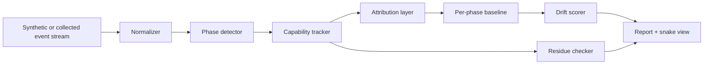

# Repo Start Mock

This is the paper version of the first VecBot repo. It is meant to be easy to
turn into code without overcommitting to graph math, RL, or heavyweight EDR
claims too early.

## Project Name

Internal name:

```text
VecBot
```

Algorithm name:

```text
Phase-Attributed Capability Drift Detection
```

Optional visual/UX name:

```text
Snake Phase Detector
```

## Core Question

For a process under observation:

```text
What capabilities appeared, when did they appear, what caused them, and did
they disappear when the process ended?
```

## MVP Scope

The MVP should detect suspicious supply-chain style behavior in process traces:

- install-time network access from a package that should only build locally
- import-time credential probing
- runtime child-process spawning by a dependency that should be passive
- late-phase outbound connections after the process has reached steady state
- shutdown residue such as child processes, persistence files, or unclosed FDs

Out of scope for the first version:

- automated blocking
- RL policy generation
- full attack graph construction
- exploit simulation
- kernel collection
- production response actions

## Design Risks

Two pieces are load-bearing enough that they should be designed before the first
module lands:

- **Attribution:** `actor`, `package`, and `module` cannot be magic fields in
  the event schema. The first implementation needs a clear strategy for Python
  import hooks, frame inspection, subprocess inheritance, native extensions, and
  unknown attribution.
- **False-positive suppression:** drift detectors get noisy after normal deploys
  and dependency upgrades. The first implementation needs a baseline learning
  and suppression story before findings are treated as useful.

See:

- [Attribution Strategy](attribution-strategy.md)
- [Baseline Learning and False Positives](baseline-and-fp.md)

## Data Flow



## Event Model

Each normalized event should be boring and structured:

```python
Event(
    ts=1.234,
    pid=4242,
    tid=4243,
    phase_hint=None,
    source="synthetic",
    action="connect",
    target="api.example.test:443",
    capability="network.outbound",
    actor="requests",
    package="requests",
    module="requests.sessions",
    fd=7,
    metadata={"family": "AF_INET", "proto": "tcp"},
)
```

Important fields:

- `action`: raw-ish behavior, such as `open`, `connect`, `execve`, `mmap`,
  `import`, `write`, `unlink`, `fork`, `listen`, `setenv`
- `capability`: normalized category used for scoring
- `actor`: best-known responsible component
- `package` / `module`: supply-chain attribution target
- `target`: file path, host, command, library name, or resource identifier

Attribution confidence should be explicit. Some events will be confidently tied
to a Python frame or import context; others will only inherit attribution from a
process lineage or will remain unknown.

## Capability Vocabulary

Start with a compact vocabulary:

```text
fs.read
fs.write
fs.exec_path_touch
net.outbound
net.listen
proc.spawn
proc.inject_like
ipc.open
mem.rwx
mem.dynamic_code
secret.env_read
secret.file_read
identity.user_lookup
persistence.startup_hook
logs.tamper
```

This is more useful than raw syscall count because the same syscall can mean
different things in different contexts.

## Phase Model

Use a simple learned state machine first:

```text
START -> INIT_IMPORT -> STEADY_RUN -> SHUTDOWN -> EXITED
```

Phase boundary signals:

- burst of imports or dynamic library loads
- stable syscall/capability distribution for N windows
- first request loop / main loop marker if known
- subprocess or socket creation after prior quiet period
- process exit, signal, final close burst, or child reparenting

The detector should allow unknown subphases:

```text
STEADY_RUN.1
STEADY_RUN.2
```

This lets the system learn that a service can have several legitimate runtime
modes without treating every shift as hostile.

## Detection Loop

High-level pseudocode:

```python
for event in stream:
    normalized = normalize(event)

    phase = phase_detector.update(normalized)
    capability_tracker.observe(normalized, phase)

    attribution.observe(normalized, phase)

    current_window = capability_tracker.window(phase)
    baseline = baselines.for_phase(phase)

    drift = js_divergence(current_window.distribution, baseline.distribution)
    new_caps = capability_tracker.new_capabilities(phase)
    weird_actor = attribution.unexpected_actor(normalized, phase)

    finding = score(
        drift=drift,
        new_capabilities=new_caps,
        unexpected_actor=weird_actor,
        phase=phase,
    )

    if finding.is_interesting:
        report.emit(finding)

on_process_exit:
    residue = residue_checker.inspect(process_snapshot)
    report.emit_residue(residue)
```

## Scoring

Avoid magic weighted scores in v1. Prefer explainable findings:

```text
finding =
  phase is STEADY_RUN
  package is leftpad_pro
  new capability is proc.spawn
  action is execve
  target is /bin/sh
  baseline frequency for proc.spawn in this phase is 0
```

Use Jensen-Shannon divergence as supporting evidence:

```text
current phase drift: 0.42
historical phase p95: 0.09
```

JS divergence should not be the headline signal in the first version. Sparse
short-window distributions will be noisy, especially when dominated by
`fs.read` and `fs.write`. The primary signal should be simpler:

```text
new or rare capability + package/module attribution + phase mismatch
```

The drift number is useful when it reinforces that explanation.

## Snake View

The snake is a UI/debugging projection of the data:

```text
[START]       head: argv env loader
[INIT_IMPORT] head + ribs: imports fs.read secret.env_read
[STEADY_RUN]  head + legs: net.outbound proc.spawn
[SHUTDOWN]    shed skin: temp file child process startup_hook
```

Simple terminal mock:

```text
pid 4242  phase STEADY_RUN  drift 0.42
snake: ====O===[net.outbound]===[proc.spawn]===
cause: package suspicious_build_helper imported at t=1.28s
note: proc.spawn never appeared in STEADY_RUN baseline
```

## CLI Sketch

```text
vecbot simulate --scenario malicious-import
vecbot analyze examples/traces/malicious-import.jsonl
vecbot render examples/traces/malicious-import.jsonl --view snake
vecbot baseline examples/traces/clean-*.jsonl --out baselines/python-web.json
vecbot compare run.jsonl --baseline baselines/python-web.json
```

## First Scenarios

Clean package:

```text
START: open python, read argv/env
INIT_IMPORT: read package files, import modules
STEADY_RUN: read config, serve requests
SHUTDOWN: close sockets, delete temp files
```

Malicious install:

```text
START: run setup script
INIT_IMPORT: read env, read ~/.pypirc, connect remote host
STEADY_RUN: quiet
SHUTDOWN: no residue
```

Malicious runtime:

```text
START: normal
INIT_IMPORT: normal
STEADY_RUN: after delay, spawn shell and connect outbound
SHUTDOWN: child process remains
```

Persistence residue:

```text
START: normal
INIT_IMPORT: normal
STEADY_RUN: writes ~/.config/autostart/helper.desktop
SHUTDOWN: parent exits, helper remains
```

## Implementation Milestones

0. Write attribution strategy and baseline/false-positive design docs.
1. Define `Event` and trace JSONL format.
2. Build synthetic trace generator for clean and malicious scenarios.
3. Implement package/phase capability set membership.
4. Implement windowed capability histograms.
5. Add conservative phase detection using explicit markers, quiet periods, and
   distribution shifts.
6. Add Jensen-Shannon drift scoring as supporting evidence.
7. Add residue checker over final synthetic process snapshot.
8. Add text reports and snake view.
9. Only then wire a real collector.

## Success Criteria

The first version is useful if it can produce reports like:

```text
Suspicious phase drift detected
pid: 4242
phase: STEADY_RUN
package: markdown_theme_helper
new capability: proc.spawn
action: execve /bin/sh
evidence: capability absent in baseline, JS divergence 0.42 above p95 0.09
residue: child process 4249 still alive after parent exit
```

No blocking, no claims of certainty. Just crisp phase-aware evidence.
